# Evolvectl

Upgrade codebases, not just dependency files.

Evolvectl finds the manifests in a repository, plans a dependency upgrade, applies deterministic recipes, runs the checks you already have, and writes one report. The terminal, JSON, Markdown, and a single offline HTML file all render that same report.

```bash
evolvectl init
```

`init` writes `.evolvectl.yaml` and an offline guide at `.evolvectl/guide/`, then opens `index.html` in your browser. The guide is a small local site:

| Page | What you learn |
| --- | --- |
| Start | What an upgrade is, and how that job differs from Copybara |
| Copybara | How Copybara and any tool in that role plug into a campaign |
| Languages | Go, Python, Maven, Node, and Bazel, and what each one can repair |
| How it works | The ten stages, dry-run, offline mode, and reports |
| Commands | Every command, with the flags that matter and a copyable example |
| Recipes | The bundled transforms and how golden files work |
| Examples | The fixtures in this repository |
| Troubleshooting | The messages a run actually stops with |

Pass `--no-browser` to write the files and leave the browser alone. After the config already exists, `evolvectl help` rewrites the guide and opens the command page. `evolvectl docs languages --format html` opens one topic. `evolvectl --help` stays the short terminal summary.

## Copybara and evolvectl: who does what

A dependency upgrade is two jobs.

1. **Bring the new version of the library in.** In a repository that keeps a copy of third-party code, someone has to copy the new source into `third_party/`. That is **Copybara's** job: it moves files from one repository to another and applies the path and text changes written in `copy.bara.sky`.
2. **Make your code work with it.** Your code still calls the old API. Imports, signatures, and callbacks have to change, and the tests have to prove nothing broke. That is **evolvectl's** job. It edits your checkout, runs your tests before and after, and writes a report.

Copybara does not know what your code calls. Evolvectl does not copy code between repositories. They sit next to each other:

```mermaid
flowchart LR
    UP["Upstream library<br/>github.com/googleapis/gax-go<br/>tag v2.0.2"]

    subgraph CB["Copybara: moves the library's code"]
        SKY["copy.bara.sky<br/>workflow and ref"] --> MIG["copybara migrate"]
    end

    subgraph REPO["Your repository"]
        TP["third_party/gax<br/>the library copy"]
        APP["Your services<br/>code that calls gax"]
    end

    subgraph EV["evolvectl: fixes the code that uses it"]
        direction TB
        E1["scan, outdated --online<br/>what is old, what is vulnerable"] --> E2["impact<br/>which files and lines break"]
        E2 --> E3["upgrade<br/>go.mod, imports, API recipes"]
        E3 --> E4["go test before and after<br/>coverage before and after"]
        E4 --> E5["report.html, branch, pull request"]
    end

    UP --> MIG --> TP
    TP -. "used by" .-> APP
    APP --> E1
    E3 -- "edits" --> APP
    PIN["evolvectl copybara pin<br/>sets the ref"] -. "optional" .-> SKY
    VEN["evolvectl vendor<br/>for repos wired by go.mod"] -. "instead of Copybara" .-> TP
```



### Example: gax-go from v0 to v2.0.2

The task: services use `github.com/googleapis/gax-go` at `v0.0.0-20161107002406-da06d194a00e` from 2016 and must move to `v2.0.2`. Between those versions the module moved to a new path, `github.com/googleapis/gax-go/v2`, and `gax.APICall` changed from `func(context.Context) error` to `func(context.Context, gax.CallSettings) error`. Every closure passed to `gax.Invoke` stops compiling.

| Step | By hand | Who does it with these tools |
| --- | --- | --- |
| Find every place that uses gax | grep across the repository, one module at a time | `evolvectl scan` walks every module in the repository |
| Know which version to move to | read release notes, notice that `v2.0.2` without `/v2` is the old `+incompatible` copy | `evolvectl outdated --online` shows `gax-go/v2@v2.21.0` exists; `plan` warns about `+incompatible` |
| Know what will break before touching code | read two versions of the source and compare | `evolvectl impact` lists removed and changed API and each file and line that uses it |
| Bring the new library source in (monorepo with `third_party/`) | edit `copy.bara.sky`, run the import | Copybara: `copybara migrate`. `evolvectl copybara pin --ref v2.0.2` edits the ref for you and shows the diff |
| Bring it in (repository with `go.mod`) | `go get`, fix go.sum, or copy into `third_party/` and add a `replace` | `evolvectl upgrade` or `evolvectl vendor` |
| Rewrite imports to `/v2` | edit each file | `evolvectl upgrade --to-module github.com/googleapis/gax-go/v2` |
| Fix each `gax.Invoke` closure | edit each call | the bundled `go.gax.invoke-callsettings` and `go.gax.apicall-callsettings` recipes |
| Prove nothing broke | run tests, compare by memory | tests and coverage recorded before and after; newly failing tests are listed by name |
| Notice side effects | read the go.mod diff | a dependency that went down, such as gRPC after `go mod tidy`, is listed for review |
| Hand it to a reviewer | write the PR description | `--open-pr` commits only the changed files and uses the report as the PR body |
| Do the next 40 rows of the upgrade sheet | repeat everything | `evolvectl batch --file upgrades.csv` runs every row and writes one table |
| Undo | `git checkout` and hope | `evolvectl rollback --run <id>` restores each file it changed |

The gax-go commands, in order:

```bash
evolvectl outdated --online
evolvectl impact  github.com/googleapis/gax-go --to v2.0.2 --to-module github.com/googleapis/gax-go/v2
evolvectl upgrade github.com/googleapis/gax-go --to v2.0.2 --to-module github.com/googleapis/gax-go/v2 --dry-run
evolvectl upgrade github.com/googleapis/gax-go --to v2.0.2 --to-module github.com/googleapis/gax-go/v2
evolvectl report --run <id> --format html --output gax-report.html
```

What that did on a real module using the 2016 gax-go: the import became `gax "github.com/googleapis/gax-go/v2"`, the closure became `func(ctx context.Context, _ gax.CallSettings) error`, go.mod and go.sum were updated, the `module-move` and `go test` gates passed with coverage unchanged, and the run asked for review because `go mod tidy` lowered `google.golang.org/grpc` from v1.84.0 to v1.83.0-dev. `examples/go-gax-v2` is the offline copy of that run.

Where each tool stops:

- Copybara does not change code outside the files it copies, and does not run your tests.
- Evolvectl does not run `copybara migrate`, because that can create a change in another repository. You run it.
- Evolvectl reads `go.mod`. A monorepo built only from BUILD files, with no `go.mod`, needs Copybara for the import and its own build tooling for the callers.
- `impact` reads declarations and is not type-checked. Package names in code are not renamed during a module move.

### Does evolvectl look at the whole repository?

Yes. `scan`, `plan`, and `upgrade` walk every directory under `--workspace` (the current directory by default) and find each manifest: every `go.mod`, `go.work`, `pyproject.toml`, `requirements*.txt`, `pom.xml`, `package.json`, Bazel file, and `copy.bara.sky`. A Go module three directories down is planned the same as one at the root. Run from this repository's root, `evolvectl scan` finds 14 projects across Go, Python, Maven, and Node, and `evolvectl plan github.com/googleapis/gax-go ...` finds `examples/go-gax-v2` on its own.

It skips directories that hold generated or downloaded code: `.git`, `node_modules`, `vendor`, `.venv`, `venv`, `__pycache__`, `dist`, `build`, `target`, `.idea`, and `.evolvectl`. Add more under `repository.ignore` in `.evolvectl.yaml`. File hashes are cached, so a second scan reads only files that changed.

Edits stay inside the plan: the manifests that declare the dependency, and the source files that import it. When no file imports it by name, the plan falls back to that project's source files in the same language, and recipes still change only code that matches. `plan` prints the count before anything is written, and `plan --format json` lists every file.

## Two different jobs

Copybara copies and transforms files from an origin repository into a destination repository. The workflow lives in `copy.bara.sky`. When you run `copybara migrate`, that command can open a review on a remote destination.

Evolvectl stays in the checkout you name. You give it one dependency and one target version. It edits that checkout so the code matches the new version, then records the diff and which tests moved.

| Question | Copybara | Evolvectl |
| --- | --- | --- |
| Where does the work happen? | Between an origin repo and a destination repo | Inside the workspace you pass to the command |
| What is the unit of work? | A workflow in `copy.bara.sky` | One dependency moved to one target version |
| What changes the bytes? | Starlark transforms, when you run the Copybara binary | Manifest edits and YAML recipes |
| What proves the result? | The destination review you asked Copybara to create | The same tests and coverage, before the edit and after it |

A repository can use both. `evolvectl copybara explain` reads `copy.bara.sky` as text: it substitutes top-level `name = "literal"` assignments, traces literal globs and `core.move` / `core.replace`, and leaves every other call unresolved. It executes no Starlark. If the `copybara` binary is missing, explain still prints that static view.

`evolvectl upgrade` leaves `copybara migrate` for you to run yourself, because that command can create a review on a remote destination. Selecting `--provider copybara` requires the binary on `PATH`. Preflight stops with `COPYBARA_NOT_FOUND` when it is missing, and the next step is to install Copybara or `evolvectl session export git`.

```bash
evolvectl copybara explain --config examples/mixed-monorepo/copy.bara.sky --workflow export-go-lib --file go/client/client.go
```

In that fixture, `go/client/client.go` is included, moved to `third_party/go/client/client.go`, and left alone by the BUILD-only `core.replace`. `go/vendor/x.go` is excluded. Credential-shaped URLs are redacted.

## How a tool like Copybara fits

The campaign stages stay the same for every workspace. Three slots change:

- A **provider** tells evolvectl where the code lives and whether the worktree is clean.
- A **language adapter** knows how to read one ecosystem and, for Go and Python, how to repair source.
- A **command adapter** names the program that proves the change. The exit code is the proof.

Built-in providers:

| Provider | Role |
| --- | --- |
| `filesystem` | Read the directory. Always available. |
| `git` | Read `git status` before an edit. A dirty worktree blocks `upgrade` until you commit, stash, or pass `--allow-dirty`. Dry-run allows a dirty tree. |
| `copybara` | Require the Copybara binary, and explain `copy.bara.sky`. Migration stays a Copybara command. |
| `command` | Run the validator argv you configured. |

Precedence on one command is `--provider`, then `EVOLVECTL_WORKSPACE_PROVIDER`, then `workspace.type` in `.evolvectl.yaml`, then auto. Auto picks git when the workspace has a `.git` directory, and filesystem otherwise.

`init` leaves the environment variable unset, so a new terminal stays unset until you export a provider there. A child process can print a shell assignment. The parent shell changes when you paste or eval that line. Session export writes nothing to the repository.

```powershell
evolvectl session export git --shell powershell
# paste the printed line into this same terminal:
# $env:EVOLVECTL_WORKSPACE_PROVIDER='git'
evolvectl session current
```

```bash
eval "$(evolvectl session export git)"
```

A tool evolvectl has never heard of uses one of two extension points.

- A command adapter is YAML under `.evolvectl/adapters`. It names an argv. Evolvectl runs it and records the exit code. Coverage is recorded only when the tool printed a number.
- An executable adapter is a program named `evolvectl-adapter-*`. It speaks a JSON handshake on stdin and stdout. The core records the capabilities the program advertises.

`examples/custom-tool-plugin` implements the handshake.

## Languages

Discovery is broad. Repair is specific. A manifest edit and a green delegated command are real results, and they are a different result from a recipe that rewrote the source. `evolvectl adapters` prints the matrix for the workspace you are in.

| Ecosystem | Discovers | Edits | Repairs source | Proves it |
| --- | --- | --- | --- | --- |
| Go | `go.mod`, `go.work` `use` entries | Module version. Online, `go get module@version` updates `go.sum` unless the requirement is a local `replace` | Go AST recipes | `go test` when `go` is installed |
| Python | `pyproject.toml`, `requirements*.txt` | Declared versions | Structural recipes. Quoted strings stay quoted | pytest when test files and pytest exist. coverage.py when it is installed |
| Java / Maven | `pom.xml` | Version in the POM | Unavailable. The run finishes as needs-review | The command you configured |
| Node | `package.json` | Version in `package.json` | Unavailable. A successful manifest edit still needs review | Only when a command adapter defines one |
| Bazel | `WORKSPACE`, `MODULE.bazel`, `BUILD` | Recorded on the inventory | Unavailable from the core | Only when you configure that command. A skipped optional gate stays skipped |
| Copybara | `copy.bara.sky` | Static explanation | Traces a few literal transforms | You run `copybara migrate` when you want a migration |

Go recipes cover imports, calls, call arguments, and struct fields. The gRPC recipes rewrite `DialContext` to `NewClient` and rename a server config field.

`--offline` keeps `go test` from using a module proxy. The same flag refuses to continue when `go.sum` lacks the target version and the requirement is a downloaded module. A dry-run stops with a named error when a `replace` points outside the workspace.

Python dependencies are named `python:<distribution>`. The bundled pydantic recipes rename the import, `@validator`, `.dict()`, and the `orm_mode` keyword. A quoted `orm_mode=True` string is left unchanged. In the pydantic example the required gate is a delimiter balance check.

Maven dependencies are named `maven:group:artifact`. Node dependencies are named `node:<name>`.

## Install

No package release is required. With Go installed:

```bash
go install github.com/sureshpsc/evolvectl/cmd/evolvectl@latest
evolvectl version
```

That places `evolvectl` in `$(go env GOPATH)/bin`. From a local checkout, `go install ./cmd/evolvectl` does the same. A GitHub release is only for downloading a binary on a machine that does not have Go.

## Quickstart

```bash
evolvectl init
evolvectl scan --workspace examples/mixed-monorepo
evolvectl plan google.golang.org/grpc --to v1.75.0 --workspace examples/git-go-grpc
evolvectl upgrade google.golang.org/grpc --to v1.75.0 --no-ai --workspace examples/git-go-grpc
evolvectl report --run <id> --format html --output report.html
```

`upgrade` writes the workspace. `--dry-run` applies the same steps in a temporary copy and leaves the original source unchanged. AI stays off unless you enable it in `.evolvectl.yaml`. `--no-ai` forces the deterministic path for that command.

## How one upgrade runs

A campaign is one dependency, one target version, and one directory under `.evolvectl/runs/<id>/`. That directory holds `report.json`, `report.html`, `events.jsonl`, and Go coverage profiles when a tool wrote them.

| Stage | What it does |
| --- | --- |
| preflight | Choose git or filesystem when the provider is auto. Record git HEAD. Block a dirty worktree unless `--allow-dirty` or `--dry-run`. When the provider is copybara, require the Copybara binary. |
| discover | Walk the workspace once. Record projects, manifests, dependencies, Bazel files, and any `copy.bara.sky`. |
| assess | Mark declared versions as `registry_unavailable` when no registry was queried. The report keeps the version written in the manifest. |
| plan | Resolve the dependency, affected projects, matching recipes, and validators. Store a hash of the planned files. |
| prepare | On `--dry-run`, copy the workspace to a temp directory first. Then run the existing tests and coverage before any edit. |
| apply | Stop if a planned file changed after the plan (`stale plan hash`). Otherwise edit manifests and apply recipes. Snapshot the old bytes. |
| diagnose | Group compiler and test diagnostics. |
| repair | Apply deterministic recipe repairs inside the same upgrade. The `repair` command itself edits nothing. |
| validate | Run the same commands again. Newly failed tests are listed apart from tests that were already failing. |
| finalize | Write the report and the next-step hint. |

`plan` saves a run and skips every stage after plan. `upgrade --resume <id>` continues a cancelled run.

Prepare and validate run the same commands. The report shows passed and failed counts before and after, plus newly failed, still failing, and fixed since the baseline. Coverage numbers are recorded only when the tool printed them.

`rollback --run <id>` restores each snapshotted file when its current bytes still match the campaign. Files the run created, such as a new `go.sum`, are removed.

## Flags on every command

| Flag | Meaning |
| --- | --- |
| `--workspace` | Repository root. Default is the current directory. |
| `--config` | Config file. Default is `.evolvectl.yaml`. |
| `--provider` | Provider for this command only. Overrides `EVOLVECTL_WORKSPACE_PROVIDER`. |
| `--no-ai` | Deterministic path for this command. |
| `--offline` | Skip package registries and the module proxy. |
| `--format` | `text` (default), `json`, `md`, or `html` where that command renders a report. |
| `--allow-dirty` | Continue when the git worktree has uncommitted changes. |

## Commands

`evolvectl help` opens the same reference as HTML, with a filter. The examples below are the ones to copy.

### version

Print the evolvectl version. Talks to no repository.

```bash
evolvectl version
```

### init

Create `.evolvectl.yaml`, the `.evolvectl/` directories (`cache`, `logs`, `reports`, `patches`, `snapshots`, `runs`), and the HTML guide. Opens `index.html` unless you pass `--no-browser`.

`--force` replaces an existing config and rewrites the guide. `--minimal` writes a smaller ignore list. `--provider git` stores that provider in the new config file. The environment variable stays unset either way.

Exit 2 when the config already exists and `--force` is absent.

```bash
evolvectl init
evolvectl init --no-browser
evolvectl init --force --no-ai
```

### scan

Walk the workspace once and print a dependency inventory. Modifies no source and starts no UI server. A single path argument is the workspace. Versions are the ones declared in manifests.

```bash
evolvectl scan --workspace examples/mixed-monorepo
evolvectl scan --format html
evolvectl scan --format json
```

`--format html` prints one offline inventory page on stdout.

### graph

Show the dependency and impact graph. `--dependency` limits the textual summary. `--out` writes JSON to a path.

```bash
evolvectl graph --format json
evolvectl graph --dependency google.golang.org/grpc
```

### outdated

List declared dependencies. Without `--online`, status stays `registry_unavailable`, which means the declared version was left as declared and nothing was looked up.

With `--online`, Go modules are resolved with `go list -m <module>@latest` through your GOPROXY. The next major path is checked too, so a module on `gax-go` v0 shows that `gax-go/v2@v2.21.0` exists. Python, npm, and Maven use PyPI, the npm registry, and Maven Central. OSV is asked about the exact declared version. Ranges such as `^1.1.0` are reported as unresolved rather than guessed.

```bash
evolvectl outdated
evolvectl outdated --online
evolvectl outdated --online --format html > outdated.html
```

Exit 6 when a declared version has a known vulnerability.

### impact

Compare the exported API of the current and target versions and list every file and line that uses a removed or changed symbol. Both versions come from `go mod download`, or from a local replace directory. A symbol whose signature text did not change but mentions a changed type is reported as `indirect`; that is how `gax.Invoke` shows up when `APICall` gains a `CallSettings` parameter. Nothing is edited. Go only, and the comparison is not type-checked.

```bash
evolvectl impact github.com/googleapis/gax-go --to v2.0.2 --to-module github.com/googleapis/gax-go/v2 --workspace examples/go-gax-v2
evolvectl impact google.golang.org/grpc --to v1.75.0 --format json
```

### plan

Plan an upgrade and write no source. The run is saved under `.evolvectl/runs`. Pass a Go module path, or `python:pydantic`, `maven:junit:junit`, or `node:left-pad`. `--to` is the target version. `--dependency` is the same value as the positional argument.

Exit 2 when the dependency is missing or unknown.

```bash
evolvectl plan google.golang.org/grpc --to v1.75.0 --workspace examples/git-go-grpc
evolvectl plan python:pydantic --to 2.11.0 --workspace examples/python-pydantic
```

### upgrade

Run the full campaign and edit the workspace. `--dry-run` uses a temporary copy. Pass only one of `--dry-run` and `--apply`. `--apply` is accepted for explicitness: upgrade already writes unless `--dry-run` is set. `--resume <id>` continues a cancelled run.

Ecosystems without a source recipe finish as needs-review (exit 6) when the manifest change is the whole edit. Read the report before treating that tree as done.

```bash
evolvectl upgrade google.golang.org/grpc --to v1.75.0 --no-ai --workspace examples/git-go-grpc
evolvectl upgrade python:pydantic --to 2.11.0 --dry-run --workspace examples/python-pydantic
evolvectl upgrade maven:junit:junit --to 4.13.2 --workspace examples/java-maven-command-adapter
evolvectl upgrade node:left-pad --to 1.3.1 --workspace examples/node-pnpm-command-adapter
```

Exit 0 when required gates passed, 5 when validation failed, 6 when the run needs review, 9 when the worktree is dirty.

**Major versions and module moves.** `--to-module` moves Go code to a new module path. The go.mod require is swapped, every import is rewritten, `go get` and `go mod tidy` update go.sum, and recipes for the new API run. The `module-move` gate fails if any file still imports the old path. Package names used in code are not renamed. If tidy lowers another requirement, the run lists it for review.

```bash
evolvectl upgrade github.com/googleapis/gax-go --to v2.0.2 --to-module github.com/googleapis/gax-go/v2
```

Without `--to-module`, asking for `v2.0.2` on `github.com/googleapis/gax-go` resolves to `v2.0.2+incompatible`, the pre-modules copy. The plan says so and suggests the `/v2` path.

**Pull requests.** `--open-pr` commits only the files the run changed, on a new branch named `evolvectl/<module>-<version>`, pushes it, and runs `gh pr create` with the report as the body. It never force-pushes. A run that succeeded opens a normal pull request, a run that needs review opens a draft, and failed, blocked, or dry runs are not published. `--pr-base` picks the base branch.

### vendor

Copy a module version into a directory in the repository and point go.mod at it. The directory is replaced with the downloaded files, `METADATA.evolvectl.json` records the module, version, go.sum hash, and license file, and a `replace` directive is added to each go.mod. Then the run validates like `upgrade`. A missing license file ends the run as needs-review, and rollback puts the previous directory back.

```bash
evolvectl vendor github.com/googleapis/gax-go --to v2.0.2 --to-module github.com/googleapis/gax-go/v2 --dir third_party/gax
evolvectl vendor golang.org/x/text --to v0.21.0 --dir third_party/text --dry-run
```

This is the open-source-repository version of a third_party import. It does not write Google BUILD or METADATA files.

### batch

Run every row of an upgrade sheet and write one combined report to `.evolvectl/batches/<id>/batch.html`, with `batch.md` and `batch.json` beside it.

A CSV needs a dependency and a target version per row. Headers are matched loosely: `Dependency`, `Package`, or `Module`; `To` or `Target Version`; `To Module`; `Workspace`, `Path`, or `Directory`; `Owner` or `Developer Owner`. YAML uses the same keys under `upgrades:`.

```yaml
upgrades:
  - dependency: github.com/googleapis/gax-go
    to: v2.0.2
    to_module: github.com/googleapis/gax-go/v2
    workspace: services/speech
    owner: Suresh
```

| `--mode` | What happens |
| --- | --- |
| `dry-run` (default) | Each row runs on its own temporary copy. The workspace is not changed. |
| `apply` | Rows edit the workspace one after another. |
| `branches` | Each row runs on its own branch from the current commit and is committed there. Needs a clean worktree. `--open-pr` also pushes and opens a pull request per row. |

```bash
evolvectl batch --file upgrades.csv
evolvectl batch --file upgrades.yaml --mode branches --open-pr --pr-base main
```

Exit 0 when every row succeeded, 6 when some need review, 4 when some failed.

### analyze

Group diagnostics from a log or the latest run. `--log` selects the parser input. Go compiler output is the default parser.

```bash
evolvectl analyze
evolvectl analyze --log build.log
```

### repair

Prints a reminder that deterministic repair already runs inside `upgrade`. This command applies no second edit.

```bash
evolvectl repair
```

### validate

Show the validation gates recorded for a run. `--run` defaults to the latest run.

```bash
evolvectl validate --run <id>
```

### explain

Explain one recorded change. Pass a file path the run edited, or `--change chg_…`.

```bash
evolvectl explain client/client.go
evolvectl explain --change chg_123 --run <id>
```

### diff

Print the diffs recorded for a run.

```bash
evolvectl diff --run <id>
```

### history

List local runs stored under `.evolvectl/runs`.

```bash
evolvectl history
```

### rollback

Restore files snapshotted by a run. `--run` defaults to the latest run.

```bash
evolvectl rollback --run <id>
```

### report

Render a saved run. `--run` is required. HTML is one offline file and rescans nothing. `--output` writes the report to a path.

```bash
evolvectl report --run <id> --format json
evolvectl report --run <id> --format html --output report.html
```

Text is the default for scan, plan, upgrade, and report. `--format html` on `scan` renders the inventory. On `plan` and `upgrade` it renders the run. `evolvectl ui serve` is separate: it serves runs already stored under `.evolvectl`, binds `127.0.0.1` only, and modifies no source. Stop it by stopping that process. Plain scan, plan, and upgrade start no server.

```bash
evolvectl ui serve --host 127.0.0.1 --port 0
```

### recipe

Inspect and test migration recipes.

```bash
evolvectl recipe list
evolvectl recipe scaffold
evolvectl recipe test ./recipes
```

`recipe scaffold` prints a template. Shell transforms and exec transforms are rejected. `recipe test` defaults to the `recipes` directory. Golden files live in `testdata/input` and `testdata/expected` next to `recipe.yaml`.

Bundled recipes:

| ID | What it changes |
| --- | --- |
| `go.import.path-replace` | A Go import path |
| `go.call.rename` | A Go function call |
| `go.call.insert-arg` | Insert a call argument |
| `go.call.remove-arg` | Remove a call argument |
| `go.struct.field-rename` | A struct field |
| `go.grpc.dialcontext-to-newclient` | `grpc.DialContext` becomes `grpc.NewClient` |
| `go.grpc.serverconfig-field` | A gRPC server config field |
| `python.import.path-rename` | `pydantic.v1` imports move onto `pydantic` |
| `python.decorator.validator` | `@validator` becomes `@field_validator` |
| `python.method.dict` | `.dict()` becomes `.model_dump()` |
| `python.keyword.orm-mode` | `orm_mode` becomes `from_attributes` |

### adapters

Show adapter capability levels, then any YAML command adapters under `.evolvectl/adapters`.

```bash
evolvectl adapters
evolvectl adapters --format json
```

### provider

List built-in providers: filesystem, git, copybara, and command.

```bash
evolvectl provider list
```

### session

Terminal-scoped provider selection. These commands print shell text and write no repository config.

```bash
evolvectl session current
evolvectl session use git
evolvectl session export git --shell powershell
evolvectl session clear --shell powershell
```

`session current` prints `workspace=<unset>` when the environment variable is empty. `--shell` accepts `bash`, `zsh`, `fish`, or `powershell`.

```bash
eval "$(evolvectl session export git)"
```

### docs

Print a short topic, or open the matching HTML page.

Topics: `quickstart`, `providers`, `recipes`, `copybara`, `languages`, `examples`, `troubleshooting`, `ui`, `session`.

```bash
evolvectl docs copybara
evolvectl docs languages --format html
evolvectl docs --format html --no-browser
```

### benchmark

Time a local operation. The only subcommand times discovery.

```bash
evolvectl benchmark scan examples/mixed-monorepo
```

### doctor

Check config, the provider and where it came from, whether AI is enabled, and whether `git`, `go`, `python`, and the configured Copybara binary are on `PATH`.

A missing optional tool prints `UNAVAILABLE`. Doctor still exits 0. Copybara is optional unless you select that provider.

```bash
evolvectl doctor
```

### ui

Local read-only dashboard for saved runs. There is no global PID file.

```bash
evolvectl ui serve --host 127.0.0.1 --port 0
evolvectl ui stop
```

`--host` defaults to `127.0.0.1` and other hosts are refused. `--port 0` picks a free port.

### copybara

Inspect `copy.bara.sky` without migrating. See [Two different jobs](#two-different-jobs).

```bash
evolvectl copybara list --config examples/mixed-monorepo/copy.bara.sky
evolvectl copybara explain --config examples/mixed-monorepo/copy.bara.sky --workflow export-go-lib --file go/client/client.go
```

`--config` defaults to `copy.bara.sky`. `--workflow` selects a workflow. `--file` traces one path through it.

`copybara pin` changes the origin `ref` of one workflow and prints the diff. The rest of the file is kept byte-for-byte. The origin can be inline or a top-level name, and the ref can be a string or a top-level name bound to a string; each is changed where it is defined. A missing ref is added. A computed ref is refused. Copybara is not run.

```bash
evolvectl copybara pin --workflow default --ref v2.0.2 --dry-run
evolvectl copybara pin --config third_party/gax/copy.bara.sky --workflow import --ref 3c9b8f1
```

### completion

Generate a shell completion script. The argument is `bash`, `zsh`, `fish`, or `powershell`. The default is bash.

```bash
evolvectl completion powershell
```

### help

With no arguments, rewrite `.evolvectl/guide` and open `help.html`. `--no-browser` writes the files and prints the path.

With a command name, print that command's terminal help.

```bash
evolvectl help
evolvectl help upgrade
evolvectl help copybara explain
evolvectl help --no-browser
```

## Exit codes

| Code | Meaning |
| --- | --- |
| 0 | Success. Required gates passed, or the command only printed information. |
| 1 | Generic failure. |
| 2 | Bad arguments, unknown dependency, or config already exists. |
| 3 | Discovery failed. |
| 4 | Upgrade failed. |
| 5 | Validation failed. |
| 6 | Needs review. Maven and Node land here when source repair is unavailable. |
| 7 | Policy refused the run. |
| 8 | A required tool is missing. |
| 9 | Dirty worktree. |
| 10 | Interrupted. |

## Examples in this repository

| Directory | Shows |
| --- | --- |
| `examples/git-go-grpc` | Go AST recipes for gRPC, with a local replace so the upgrade can run offline. `go test ./...` is the required gate. |
| `examples/go-gax-v2` | The gax-go v0 to `/v2` module move with local stubs that carry the real API shapes. The closure passed to `gax.Invoke` gains a `CallSettings` parameter. |
| `examples/python-pydantic` | Python structural recipes. |
| `examples/java-maven-command-adapter` | A `pom.xml` version edit and a delegated test command (`go run ./tools`). Java semantic repair is unavailable. |
| `examples/node-pnpm-command-adapter` | A `package.json` version edit. The run still needs review. |
| `examples/mixed-monorepo` | Discovery across Go, Python, Maven, Node, Bazel, and `copy.bara.sky`. |
| `examples/copybara-go` | The static explain command against that Copybara fixture. |
| `examples/bazel-polyglot` | A pointer at the Bazel markers. |
| `examples/custom-tool-plugin` | An `evolvectl-adapter-*` program that answers the JSON handshake. |

```bash
evolvectl scan --workspace examples/mixed-monorepo
go run ./examples/custom-tool-plugin
```

## Troubleshooting

| You see | What to do |
| --- | --- |
| `config already exists` | Pass `init --force`, or run `evolvectl help` to reopen the guide. |
| `workspace is dirty` | Commit, stash, or pass `--allow-dirty`. Dry-run allows a dirty tree. |
| `COPYBARA_NOT_FOUND` | The selected provider is copybara and the binary is missing. Install it, or `evolvectl session export git`. `copybara explain` still works without the binary. |
| `stale plan hash` | A planned file changed after the plan was saved. Run `plan` again. |
| `registry_unavailable` | This run queried no package registry. The declared version is what the report shows. |
| Exit 6 | The campaign finished and a person still has to read the result. Open the HTML report. |
| `UNAVAILABLE` from doctor | That optional tool is missing. Doctor itself still exits 0. |

```bash
evolvectl doctor
evolvectl history
evolvectl explain client/client.go --run <id>
evolvectl diff --run <id>
evolvectl rollback --run <id>
```

## License

Apache-2.0. See [LICENSE](LICENSE).
